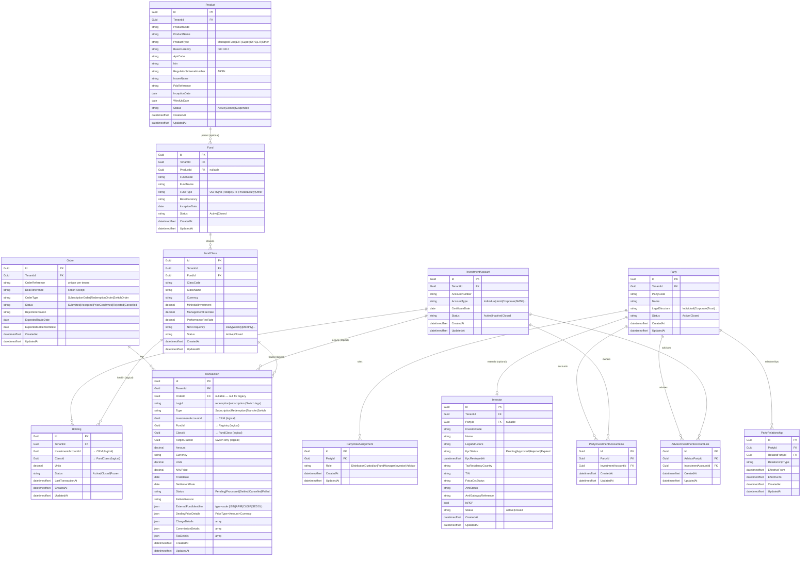

# Fund Registry — Entity Relationship Diagram

Covers all four Fund Registry modules: **Registry**, **CRM**, **Holdings**, and **Transaction**.

Cross-module references (e.g. `Transaction.ClassId → FundClass.Id`) are logical links — there are no foreign key constraints across module schemas. Integrity is enforced at the Application layer.

## Module Boundaries

| Module | Schema | Owns |
|--------|--------|------|
| Registry | `registry` | `Product`, `Fund`, `FundClass` |
| CRM | `crm` | `Party`, `PartyRoleAssignment`, `Investor`, `InvestmentAccount`, link tables |
| Holdings | `holdings` | `Holding` |
| Transaction | `transaction` | `Order`, `Transaction` |

> Cross-module references marked **"(logical)"** are `Guid` columns with no FK constraint.
> Referential integrity is enforced at the Application layer via `ICrmReader` and `IRegistryReader`.
