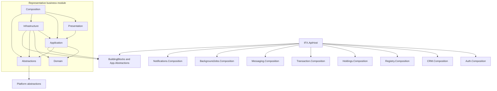
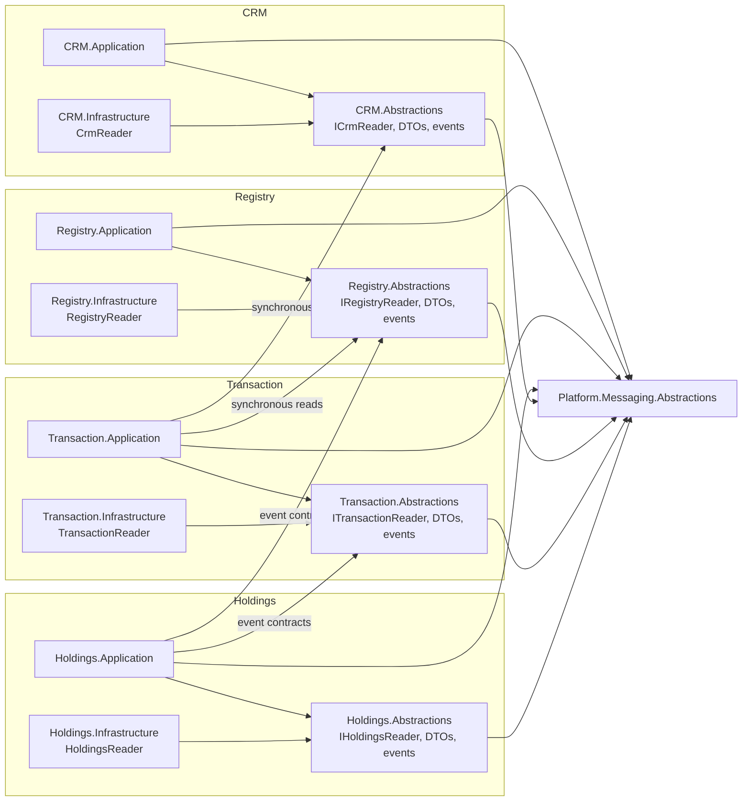

# Current IFX architecture / IFX 当前架构

> Status: source baseline at commit `308d548`. This page describes implemented code, not the proposed target.
>
> 状态：源码基线为提交 `308d548`。本页描述已经实现的代码，不是目标方案。

## Host and module structure / 宿主与模块结构

Solid arrows mean compile-time project references. The diagram expands one representative business module; CRM, Registry, Holdings, and Transaction use the same general ring structure. Auth currently has no module-level Abstractions project.

实线箭头表示编译期项目引用。图中展开一个代表性业务模块；CRM、Registry、Holdings 和 Transaction 采用相同的基本分层。Auth 当前没有模块级 Abstractions 项目。

## Implemented cross-module dependencies / 已实现的跨模块依赖

## Current boundary summary / 当前边界摘要

- Compile-time boundary: consumers reference another module's Abstractions, not its Domain, Application, Infrastructure, or Presentation.
- Database boundary: each business module owns a DbContext, migrations, and SQL schema; the schemas are normally hosted in the same `IFXDb` database.
- Transaction boundary: module DbContexts do not share an atomic business transaction.
- Deployment boundary: all modules are loaded into one ApiHost process.
- Composition boundary: ApiHost explicitly calls each `Add*Module`; `IModuleInstaller` standardizes endpoint mapping but is not dynamic plugin discovery.

- 编译期边界：消费者只引用其他模块的 Abstractions，不引用其 Domain、Application、Infrastructure 或 Presentation。
- 数据库边界：每个业务模块拥有自己的 DbContext、迁移和 SQL schema；这些 schema 默认位于同一个 `IFXDb` 数据库。
- 事务边界：模块 DbContext 之间不存在统一的业务原子事务。
- 部署边界：全部模块由同一个 ApiHost 进程加载。
- 装配边界：ApiHost 显式调用各个 `Add*Module`；`IModuleInstaller` 统一 Endpoint 映射规范，但不是动态插件发现机制。

