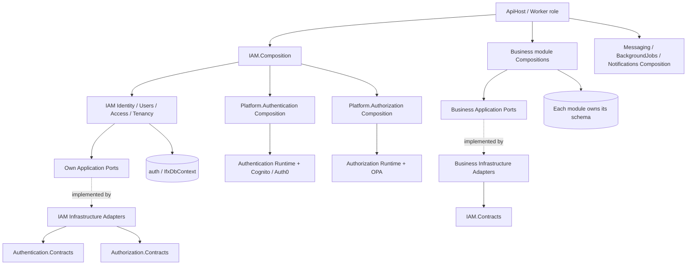

# Current IFX architecture / IFX 当前架构

Plan 05 repository implementation, 2026-09-12. 本页更新为当前代码；原审查图可从 Git 历史读取，B4 frozen evidence 未改写。

[中文实现与调用图](../iam-platform-security.zh-CN.md) · [English](../iam-platform-security.en.md) · [Generated project graph](../evidence/plan05/current-dependency-graph.json)

This is a logical overview. Dotted arrows represent port implementations, not reverse project references. Applications use versioned Contracts rather than foreign module internals. See the generated graph for exact references.

这是职责概览；虚线表达 Port 实现，不表示反向项目引用。Application 通过版本化 Contracts 消费外部能力；精确引用以生成图为准。

Five schema owners remain: IAM (logical Auth / physical auth), CRM, Registry, Holdings and Transaction. Migrator owns schema changes; API/Worker readiness checks required and explicitly compatible migrations.

五个数据 owner 保持不变。IAM 保留 AuthDatabase、auth 和历史 migration ID；UserTenants 是唯一成员事实，新增 Tenants.IsActive。共享物理库不等于共享 DbContext，运行时不自行迁移 schema。
