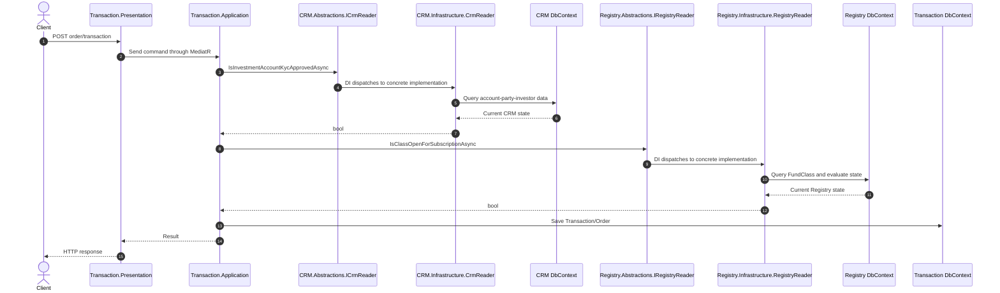
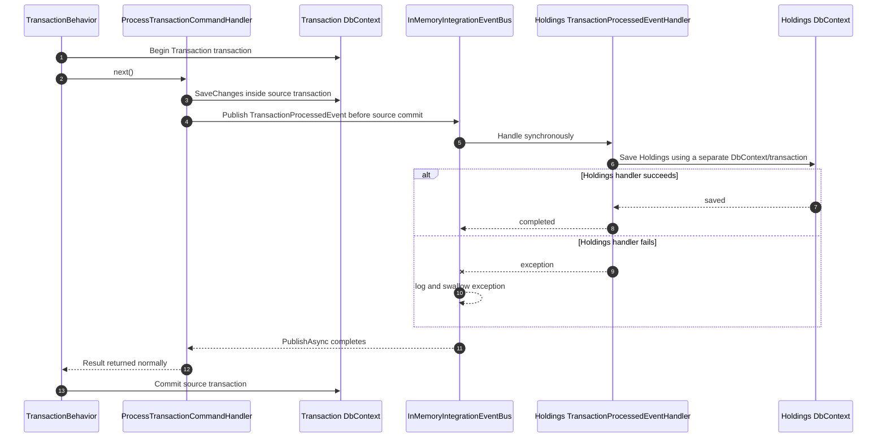

# Current communication flows / IFX 当前通信流程

> Status: implemented behavior at commit `308d548`.
>
> 状态：提交 `308d548` 上已经实现的行为。

## Synchronous cross-module read / 同步跨模块读取

The example is order creation. Transaction.Application directly depends on CRM and Registry Abstractions; their Reader implementations query the provider module DbContexts from Infrastructure.

以下以创建订单为例。Transaction.Application 直接依赖 CRM 和 Registry Abstractions；Reader 实现位于提供方 Infrastructure，并直接查询各自 DbContext。

Current implications / 当前含义：

- The call is in-process and fast, but Transaction is temporally coupled to CRM and Registry availability.
- The CRM/Registry read and Transaction write are not one atomic transaction; state may change after validation and before commit.
- A Boolean response cannot distinguish business rejection, not found, denied, timeout, or provider failure.
- The provider Application layer is bypassed by the Reader implementations.

- 调用位于同一进程内，延迟较低，但 Transaction 在运行时依赖 CRM 和 Registry 可用。
- CRM/Registry 读取与 Transaction 写入不是同一个原子事务；校验后、提交前，源状态仍可能变化。
- Boolean 返回值无法区分业务拒绝、不存在、无权限、超时或提供方故障。
- Reader 实现绕过了提供方 Application 层。

## Synchronous in-memory integration event / 当前同步内存事件

The example is `TransactionProcessedEvent` updating Holdings.

以下以 `TransactionProcessedEvent` 更新 Holdings 为例。

Failure windows / 失败窗口：

- Holdings can fail while the source transaction still commits because the bus swallows handler exceptions.
- Holdings can save successfully and the later Transaction commit can fail, leaving the reverse inconsistency.
- There is no durable Outbox, Inbox, retry schedule, dead-letter handling, or idempotent consumption record.
- A handler that catches an exception and returns `Result.Failure` still appears as a normal return to `TransactionBehavior`, which then commits.

- Holdings 可能失败，但总线吞掉异常后源事务仍然提交。
- Holdings 可能已经保存，而随后 Transaction 提交失败，产生反方向不一致。
- 当前没有持久化 Outbox、Inbox、计划重试、死信处理或幂等消费记录。
- Handler 捕获异常并返回 `Result.Failure` 时，对 `TransactionBehavior` 来说仍是正常返回，因此管道继续提交。

