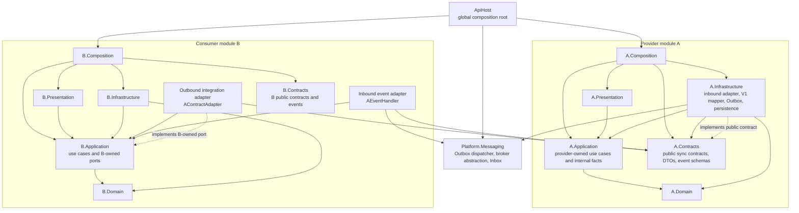
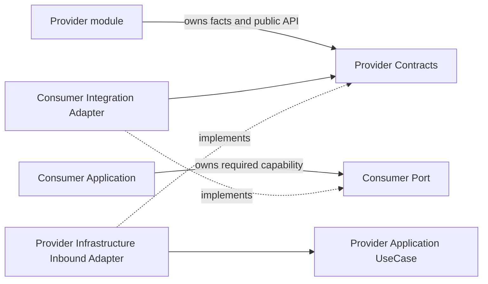

# Target Contracts, Adapters, and Events architecture / 目标 Contracts、Adapters 与 Events 架构

> Status: Plan 06 source target; database and Gate closure are tracked separately.
>
> 状态：Plan 06 源码目标；数据库验证与 Gate 关闭单独跟踪。

Solid arrows are compile-time references. Dashed arrows describe implementation or runtime binding. Contracts are type definitions, not running components.

实线箭头表示编译期引用；虚线表示实现关系或运行时绑定。Contracts 是类型定义，不是运行中的组件。

## Target dependency rules / 目标依赖规则

1. Contracts define stable public protocols only; they do not reference Application, Infrastructure, Presentation, EF Core, MediatR handlers, or domain entities.
2. A provider Application owns business use cases and internal facts, with no dependency on its own public versioned Contracts. Provider Infrastructure implements the public Contract and maps facts to V1 events before Outbox commit.
3. A consumer Application defines consumer-owned ports and does not reference another module's Contracts in strict mode.
4. Outbound Integration Adapters implement consumer ports and reference provider Contracts.
5. Inbound event adapters reference producer event Contracts and translate them into consumer-owned commands.
6. Composition owns registration; ApiHost invokes each module Composition but does not know concrete business implementations.
7. No module reads another module's DbContext or tables.

1. Contracts 只定义稳定的公开协议，不引用 Application、Infrastructure、Presentation、EF Core、MediatR Handler 或领域实体。
2. 提供方 Application 拥有业务用例和内部事实，不依赖本模块公开版本化 Contracts。提供方 Infrastructure 实现公开 Contract，并在 Outbox 提交前将内部事实映射为 V1 事件。
3. 严格模式下，消费者 Application 定义自己的 Port，不直接引用其他模块 Contracts。
4. 出站 Integration Adapter 实现消费者 Port，并引用提供方 Contracts。
5. 入站事件 Adapter 引用生产者事件 Contracts，并将外部事件转换成消费者自己的 Command。
6. Composition 负责注册；ApiHost 调用各模块 Composition，但不了解具体业务实现。
7. 任何模块都不读取其他模块的 DbContext 或数据表。

## Contract ownership / 契约所有权

The provider owns the meaning of its facts, such as KYC status. The consumer owns the decision that uses those facts, such as whether an order may be created.

提供方拥有其事实的含义，例如 KYC 状态；消费者拥有如何使用这些事实作出决策的规则，例如是否允许创建订单。

