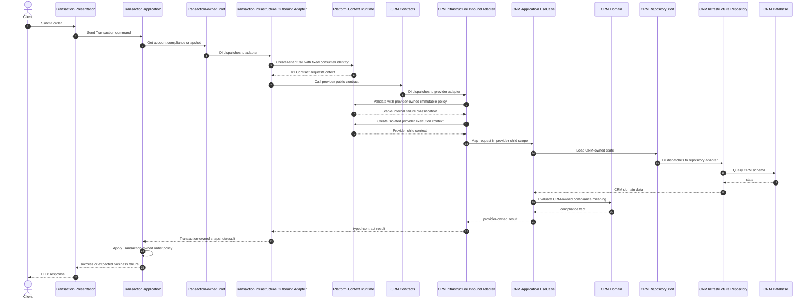

# Target synchronous Contract flow / 目标同步 Contract 流程

> Status: Plan 07 implemented source target; Gate closure is tracked separately.
>
> 状态：Plan 07 已实施源码目标；Gate 关闭单独跟踪。

The example assumes Transaction needs current CRM and Registry facts before deciding whether to create an order.

以下以 Transaction 在创建订单前需要读取 CRM 和 Registry 当前事实为例。



## Result semantics / 返回语义

The current CRM/Registry V1 success result is Boolean; boundary failures use stable Contract error codes. A future version may distinguish:

当前 CRM/Registry V1 成功结果为布尔事实，边界失败使用稳定 Contract 错误码。未来版本可进一步区分：

```text
Approved / NotApproved
NotFound
Denied
Unavailable or Timeout
InvalidRequest
```

Useful metadata may include a reason code, evaluated-at time, and source version. The provider reports its fact; the consumer applies its own business decision.

可选元数据包括原因码、评估时间和源数据版本。提供方报告事实，消费者据此执行自己的业务决策。

## Consistency note / 一致性说明

This is still not a distributed transaction. CRM state can change after the read and before Transaction commits. If that race violates a hard invariant, use an explicit reservation/authorization token with version checking, a coordinated workflow, or reconsider the module boundary.

该流程仍不是分布式事务。CRM 状态可能在读取后、Transaction 提交前发生变化。如果该竞态会破坏强业务不变量，应采用带版本检查的 reservation/authorization token、显式协调工作流，或者重新评估模块边界。

