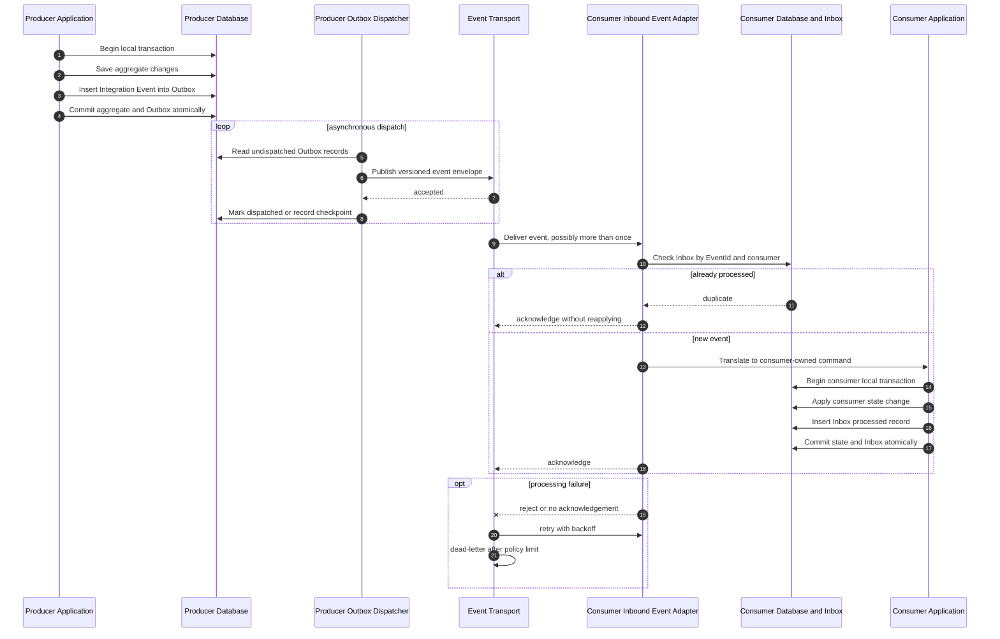

# Target durable Integration Event flow / 目标可靠 Integration Event 流程

> Status: proposed, not implemented. It requires durable Outbox/Inbox capabilities that the current in-memory bus does not provide.
>
> 状态：目标方案，尚未实现。它依赖当前内存总线尚未提供的持久化 Outbox/Inbox 能力。

Integration Events communicate facts that have already committed. They are not synchronous query responses.

Integration Event 用于传播已经提交的事实，不作为同步查询响应。

## Event contract rules / 事件契约规则

- The producer owns the event schema and uses a past-tense business fact name.
- Events are published only after the source transaction commits through the Outbox process.
- Payloads are transport-neutral and do not contain EF entities or internal domain objects.
- Schemas are versioned and changed compatibly; consumers must tolerate additive fields.
- The envelope carries identity and trace metadata such as EventId, OccurredAt, CorrelationId, CausationId, TenantId, and schema version.
- Delivery is assumed to be at least once, so consumers must be idempotent.
- An inbound event handler is an Integration Adapter; it validates and translates before invoking the consumer Application.

- 生产者拥有事件 schema，并使用过去式业务事实命名。
- 事件通过 Outbox 在源事务提交后发布。
- Payload 与传输实现解耦，不包含 EF Entity 或内部领域对象。
- Schema 具有版本并保持兼容演进；消费者应容忍新增字段。
- Envelope 携带 EventId、OccurredAt、CorrelationId、CausationId、TenantId 和 schema version 等身份与追踪信息。
- 默认传输语义为至少一次，因此消费者必须幂等。
- 入站事件 Handler 属于 Integration Adapter，负责验证和转换，然后调用消费者 Application。

## Notification versus state transfer / 通知事件与状态传输事件

- Event Notification carries an identifier and minimal fact; a consumer may query the producer afterward.
- Event-Carried State Transfer carries enough stable state for the consumer to maintain a local projection.
- A local projection reduces synchronous availability coupling but introduces eventual consistency, bootstrap, replay, ordering, and reconciliation requirements.

- Event Notification 只携带标识和最小事实；消费者之后可能还要查询生产者。
- Event-Carried State Transfer 携带足够的稳定状态，使消费者可以维护本地投影。
- 本地投影可以降低同步可用性耦合，但会引入最终一致性、初始化、重放、顺序处理和对账要求。

