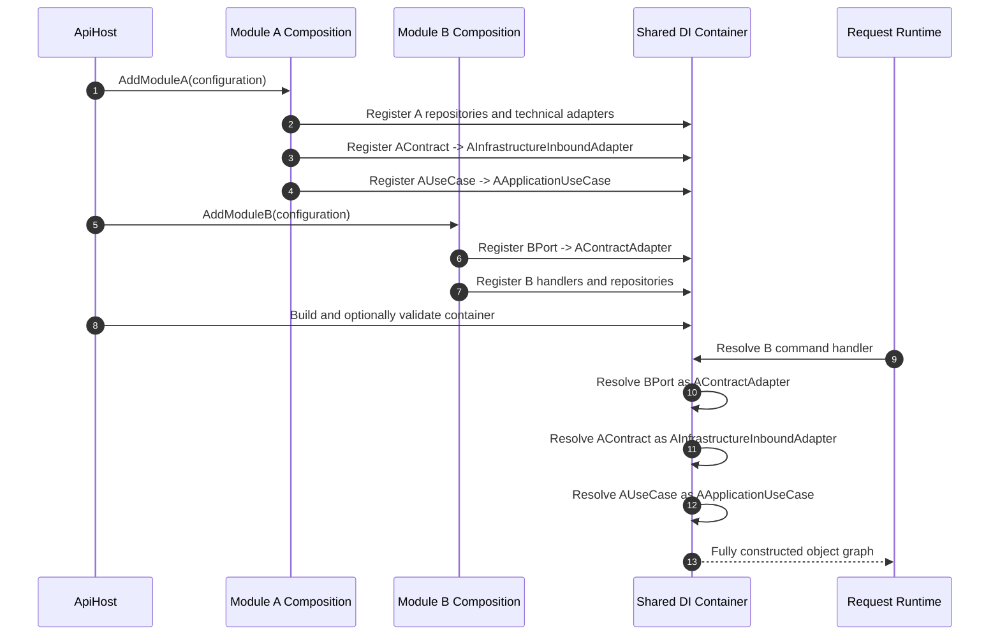

# Target DI composition flow / 目标 DI 装配流程

> Status: proposed responsibility model. The current IFX host already uses the same general module registration mechanism.
>
> 状态：目标职责模型。当前 IFX 宿主已经采用相同的模块注册机制。

Contracts never load their implementations. A module implements and registers its own public contract; ApiHost only invokes module registration.

Contracts 从不负责加载实现。模块实现并注册自己的公开契约；ApiHost 只负责调用模块注册入口。



## Responsibility split / 职责划分

```text
Implementation ownership: the module that owns the capability
Registration ownership: that module's Composition project
Global assembly and loading: ApiHost composition root

实现所有权：拥有该能力的模块
注册所有权：该模块自己的 Composition 项目
全局汇总与加载：ApiHost composition root
```

ApiHost should not register concrete business implementations directly. Otherwise it must know module internals and becomes a coupling hub.

ApiHost 不应直接注册具体业务实现，否则它必须了解模块内部细节，并逐渐成为耦合中心。

## Microservice replacement / 微服务替换

When the modules move into different processes, they no longer share a DI container. The consumer adapter changes from an in-process contract adapter to an HTTP/gRPC client, while the consumer Application port remains unchanged.

模块拆成不同进程后，不再共享 DI 容器。消费者 Adapter 从进程内 Contract Adapter 替换为 HTTP/gRPC Client，而消费者 Application Port 保持不变。


