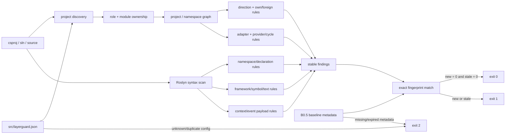

# 03-A0 LayerGuard Core Bootstrap 实施证据

> 完成日期：2026-09-07
> 工具版本：`0.3.0-a0`
> 范围：`03-layerguard-alignment.md` Phase 0–4；不包含 03-A1 Gate Policy Binding

## 结论

03-A0 已建立可在 Gate 01–05 实施期间运行的确定性静态门禁。旧工具 B0 只覆盖 20 个
Domain/Application/Presentation/Infrastructure 项目；新工具 B0.5 扫描整个 `src`，识别
39 个受管项目、4 个明确在外项目、842 个源码文件，并把 116 个历史 finding 固定为
有期限的 migration baseline。以该 baseline 重跑的结果是 `baseline-clean`：116 matched、
0 new、0 stale。

B0/B0.5 是工具演进证据，不是正式架构改善基准。Gate 03/04/05 的 catalog、最终
provider graph、Runtime Role matrix、context/security policy 与 shared primitive allowlist
仍由 03-A1 绑定，正式比较仍使用语义一致的 B1/B4。

## A0 静态分析结构



Composition 被配置为 transitive policy boundary：RuntimeHost 的直接项目引用只能指向
Composition；Host 对模块内部类型的实际源码使用仍由 namespace/import 规则检查。这样既不
把 Composition 的正常传递依赖误报为 Host 直接装载，也不能用 fully-qualified name 绕过。

## 角色与确定性矩阵

| From | A0 允许 | A0 确定性限制 |
| --- | --- | --- |
| Domain | own Domain、批准的外部 primitive | 禁止任何 Contracts/Application/外层角色 |
| Contracts | BCL；A0 active policy 默认不批准项目依赖 | 禁止框架/DI/serializer/broker、实现声明、内部 payload 类型 |
| Application | own Domain + own Contracts | foreign Contracts、runtime context implementation 禁止 |
| Presentation | own Application/Contracts/Domain | DbContext/Repository、foreign Contracts/实现禁止 |
| IntegrationAdapter | own Application + registered foreign Contracts | provider graph 外边、同步 provider cycle 禁止 |
| Infrastructure | own Application/Domain/Contracts | foreign Contracts 只能在批准的 `*.Integrations*` namespace 使用 |
| Composition | own module roles及组合所需原语 | 业务规则与最终 Gate 04 role matrix 留给 03-A1 |
| RuntimeHost | Composition | 直接引用/源码使用模块业务角色禁止；Worker 具体矩阵留给 03-A1 |

`*.Abstractions` 在迁移期按 Contracts 分析，因此不再漏扫；同时
`PROJECT-NAME-FORBIDDEN` 报告现有 7 个 legacy 项目，新增同类项目会作为 new finding
阻断。ownership 由带单个 `{module}` 捕获位的项目名 pattern 解析，避免 `Billing` 与
`BillingPlus` 前缀混淆；无法解析的受管项目 fail closed。

## B0 → B0.5 差距证据

| 检查点 | 扫描范围 | 结果 | 用途 |
| --- | --- | --- | --- |
| [B0](layerguard/B0-report.json) | `src/Modules`，20 in-scope / 9 outside，776 files | 11 findings | 旧 0.2.0 能力与漏扫记录 |
| [B0.5](layerguard/B0.5-report.json) | `src`，39 in-scope / 4 outside，842 files | 116 historical、0 new、0 stale | A0 迁移门禁 |
| [依赖图](layerguard/B0.5-dependency-graph.json) | 109 project edges、116 aggregated namespace edges | 可重复生成 | 配置与真实代码比较 |

B0.5 findings 按 rule 聚类，而不是把同一路径的项目边和源码 use 数量误当作不同架构问题：

| Rule | 数量 | 迁移解释 |
| --- | ---: | --- |
| `OWNERSHIP-REFERENCE` | 86 | 现有跨模块 Abstractions/Platform Contracts 直接、传递与源码使用 |
| `RING-REFERENCE` | 12 | Contracts/default-deny 或角色 allowlist 外项目引用 |
| `PROJECT-NAME-FORBIDDEN` | 7 | 现有 legacy `.Abstractions` 项目 |
| `IMPORT-DIRECTION` | 4 | ApiHost 直接使用模块 Application/Domain namespace |
| `RING-PACKAGE` | 3 | 旧 Application package 边界债务 |
| `DECLARATION-NAMESPACE` | 2 | 旧 IntegrationEvent 声明位置 |
| `DECLARATION-FORBIDDEN` | 1 | Contracts/Abstractions 中的实现声明 |
| `RING-PACKAGE-FORBIDDEN` | 1 | Messaging Abstractions 的 DI package 泄漏 |

baseline 位于 `mcp/LayerGuard/baselines/b0.5.json`。每个 entry 都包含 fingerprint、rule、
source/target、owner、reason、createdOn、expiresOn 和 removalCriteria；到期日为
2026-12-31。baseline 还固定工具版本和 ruleset SHA-256；缺字段、版本/规则不匹配、重复
fingerprint、过期 entry、新 finding 或代码修复后遗留的 stale entry 都不能静默通过。

## Fixture 与规则映射

| 计划项 | 自动化证据 |
| --- | --- |
| L1.1–L1.6 | `BootstrapArchitectureTests.Project_roles_and_ownership_are_recognised`、RuntimeHost、独立/内嵌 Adapter 正例 |
| L1.7 | `BaselineTests` 覆盖 exact match、expiry、stale 与 fingerprint |
| L2.1–L2.3 | own/foreign、`Billing`/`BillingPlus`、Domain → Contracts 反例 |
| L2.4/L2.10 | registered Adapter 正例、unregistered provider、provider cycle 与 Contracts cycle 反例 |
| L2.5–L2.8 | Contracts/Presentation/Infrastructure/RuntimeHost 方向、包与 source rules |
| L2.9 | unknown role、unknown property、invalid ownership、duplicate scope fail-closed tests |
| L2.11/L3.8/L4.9 | BCL-only `ContractRequestContext` 正例及 HttpContext/Claims/Activity/runtime accessor 反例能力 |
| L3.1–L3.3 | Contract/Event/Port/Adapter role + namespace rules，支持独立与内嵌 Adapter |
| L3.4–L3.6 | package/import/fully-qualified symbol、实现声明、event payload internal type 反例 |
| L3.7 | declaration rule `exceptions` 正例（`CompatibilityHandler`） |
| L3.9 | metadata/context/envelope/event payload 的声明与 type policy；字段值治理明确委托 Gate 05 validator |
| L4.1–L4.6 | 既有 direct/transitive/private/using/inactive fixture + A0 fixture 的正反例、循环和前缀场景 |
| L4.7 | unknown/duplicate config、expired/stale baseline tests |
| L4.8 | 既有 structured report tests 验证 rule、module、source、target、path、fixAt、fixHint |
| L4.10 | `scripts/Invoke-LayerGuard.ps1` 与 `.github/workflows/layerguard.yml` 使用同一路径 |

生成代码的 `*.g.cs`、`*.generated.cs`、`*.designer.cs` 以及 `bin/obj` 被排除；名称以
`.Tests` 结尾的 fixture 不会误匹配 production role。源码 using、fully-qualified syntax
name 与明确配置的反射字符串均有反例。

## 门禁职责边界

LayerGuard 负责项目/namespace 静态依赖、角色与 ownership、声明位置、禁止的包/类型、
Adapter 位置和图循环。它不声明自己验证运行时值、租户可信度、C0–C4 字段分类、purpose、
脱敏、trace 传播或消息投递语义；这些结果会在 03-A1 由 Gate 05 的 catalog/schema/
security/runtime validators 并列接入，任一失败不能被另一门禁的绿色结果掩盖。

## 统一执行

```powershell
pwsh -File scripts/Invoke-LayerGuard.ps1
```

脚本先运行完整 LayerGuard tests，再对整个 `src` 应用 `src/layerguard.json` 与 B0.5
baseline，并输出 JSON artifact。CI 在 pull request 和 main push 上执行同一脚本。

最终验证（2026-09-07）：LayerGuard tests 178 passed、0 failed、0 skipped；统一门禁
`baseline-clean`，116 matched、0 new、0 stale；`git diff --check` 无 whitespace error。
