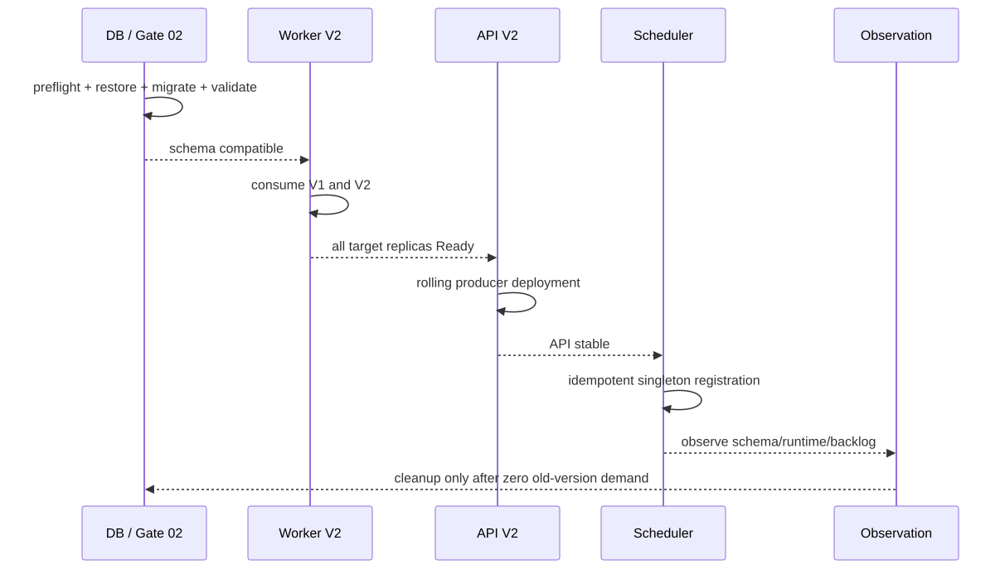

# G04 Deployment and Runtime Boundary

> Status: PRE-READY (2026-09-08)  
> Authoritative inputs: ADR-G04-001, `deployment/g04/*`, and the Gate 02 migration policy  
> Final closure still depends on Plan 02 E3/E4/E6, Gate 05, Plan 03 B2/B3/B4, production rehearsal, and owner approvals; 03-A1/B1 has returned

## Decisions

| ID | Decision |
|---|---|
| G04-D01 | Auth, CRM, Registry, Holdings, and Transaction form one `ifx-backend` business release boundary; replicas cannot select module versions independently. |
| G04-D02 | One immutable `ifx-host` artifact may run as `api`, `worker`, or local `all`; roles separate runtime capabilities, not business microservices. |
| G04-D03 | Frontend, SQL Server, Migrator, OPA, Cognito, and SendGrid may have independent deployment/managed lifecycles without changing business ownership. |
| G04-D04 | Startup loads manifests and validates Composition/endpoints first; bounded asynchronous checks then move Alive/NotReady to Ready. |
| G04-D05 | Multiple Workers use unique instance identity, short claim transactions, lease/renewal, rowversion conditional completion, and at-least-once delivery; no exactly-once or global ordering claim is made. |
| G04-D06 | SIGTERM atomically enters Stopping, rejects new claim/fetch/schedule/HTTP work, and drains admitted work within increasing budgets; timeout permits forced exit backed by durable state. |
| G04-D07 | live/startup/ready/details have separate meanings. Public probes perform no network work and expose no contributor exceptions; authenticated details reads a cache. |
| G04-D08 | Backlog evaluation combines age, category, rate, dead letters, and capacity; backpressure blocks only commands that expand the affected module/event backlog. |
| G04-D09 | Release order is database prerequisites, Worker consumer, API producer, scheduler, observation, cleanup; failures stop and never invoke automatic Down. |

## Boundary and manifests

The Module Manifest describes business identity, version, Contracts, endpoints, schema, configuration, runtime capabilities, and shutdown requirements. The Deployment Unit Catalog describes independently started/deployed processes and dependencies. The Release Manifest binds one Host artifact and all five required modules to database migration, orchestration, backpressure, and failure-policy hashes.

API replicas can scale independently but must carry the same release and complete required module set. A Worker maps no business HTTP endpoints, yet links and loads the same-version module Composition/Infrastructure assemblies. It is not an independently versioned microservice.

## Runtime roles and topology

`api` maps business endpoints and registers only the Hangfire client. `worker` starts permitted background execution and maps no business endpoints. `all` is the same-version union for local/integration use and is rejected in production by default. Dispatcher, consumers, and recurring scheduler remain separate capabilities and stay disabled until E3 supplies real implementations.

## Startup, health, and shutdown

Invalid static configuration, manifests, required modules, role combinations, or endpoint identities are startup-fatal. Recoverable SQL/schema dependencies affect readiness. `/health/live` is process/critical-loop only; `/health/startup` represents static initialization; `/health/ready` reads the role-specific cache; authenticated `/health/details` returns release, role, instance, freshness, and stable reasons.

Budgets are `10s operation < 20s handler < 30s lease < 40s process grace < 45s orchestrator kill`, with two seconds reserved for telemetry flush. Production values require target-platform load rehearsal.

## Dispatcher, backpressure, and release

Claims occur in short module-local database transactions. Send occurs outside the transaction; delivered is conditionally updated by owner/token only after broker acknowledgement. A crash after send and before the update may redeliver, so EventId is stable and Inbox handling must be idempotent. Only the earliest sequence is in flight within a partition; no global order exists.

Consumer-first rollout requires a V2 Worker that consumes V1/V2 before API V2 produces V2. All target Workers must be Ready. An API rollback retains V2 Workers while any V2 backlog/replay remains. Cleanup requires observation and evidence of zero old-version demand.

The versioned failure matrix chooses stop, old-replica retention, takeover, scoped backpressure, or bounded forced exit. No path may delete Outbox truth, invent delivered status, or automatically run Down.

## Rule-to-verification mapping

| Rule | Primary verification |
|---|---|
| G04-D01/D02/D03 | ADR, Module/Unit/Release manifests, manifest validator, RuntimeProfile tests |
| G04-D04 | StartupBoundaryVerifier, StartupDependencyMonitor, startup tests, G04 guard |
| G04-D05 | SQL Server lease conformance and identity tests; E3/E4 rerun remains final |
| G04-D06 | drain coordinator tests, Compose validation, production SIGTERM rehearsal |
| G04-D07 | health endpoint/snapshot tests and authentication; Gate 05 sentinel remains final |
| G04-D08 | backpressure policy tests; E3/E6 signals and alerts remain final |
| G04-D09 | orchestration/failure validators; production evidence and approvals remain final |
| compile-time Host boundary | LayerGuard 03-A1/B1 is bound; B2/B3/B4 continue under the same target semantics |

## Runbooks and open closure items

- Backpressure: [backpressure-recovery-runbook.md](backpressure-recovery-runbook.md)
- Failure/rollback: [failure-rollback-runbook.md](failure-rollback-runbook.md)
- ADR: [ADR-G04-001-deployment-runtime-boundary.md](ADR-G04-001-deployment-runtime-boundary.md)
- The Phase 12 handoff is authoritative for final owners, revisit triggers, and evidence. PRE-READY is not production approval.
