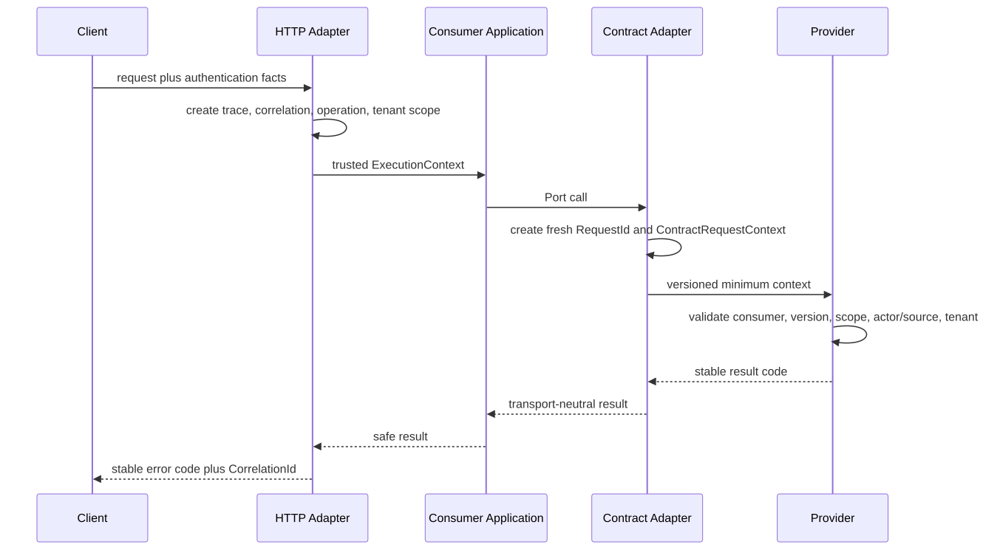
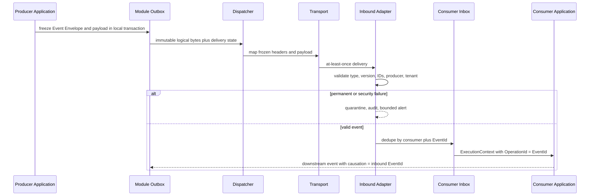

# G05 关联上下文与敏感数据边界

状态：PRE-READY（真实 Contract 与 Event 仓库载体已于 B2/B3 回交；生产证据和最终批准保持开放）
日期：2026-09-08  
Owner：xiaolong-feng

## 目标与权威来源

本设计区分业务关联、单次操作、直接因果、事件身份、技术 trace 与 tenant scope，并规定这些数据如何跨 HTTP、同步 Contract、Outbox、transport、Inbox、日志、指标和审计边界传播。它不把 header、claim、payload 或日志字段当成可信事实；只有入口 Adapter 能建立可信 `ExecutionContext`。

字段准入的唯一权威是 G03 `contract-event-catalog.yaml`；G05 的 schema、策略和测试消费该目录，不建立第二份字段目录。结构与依赖由 LayerGuard 检查，字段和值语义由 catalog/schema/runtime/security tests 检查。

## 架构决策

### G05-D01 — 身份语义不可合并

`CorrelationId` 表示业务链，`OperationId` 表示当前工作单元，`CausationId` 表示直接父工作，`EventId` 表示不可变逻辑事件，`RequestId` 表示一次 Contract 调用。它们使用强类型、非空 GUID 和 canonical `D` 文本。

### G05-D02 — ExecutionContext 只由可信 Adapter 建立

HTTP、Contract provider、event consumer、scheduled job、dispatcher 和受控管理入口通过显式 source policy 创建不可变 context。`AsyncLocal` accessor 只保存当前 scope，并用嵌套 push/pop、`finally` 清理和 detached-work suppression 防止并行 tenant 泄漏。

### G05-D03 — HTTP 入口 fail closed

公共入口创建内部 correlation 与 W3C trace；默认不采用外部 correlation。可信 gateway 必须显式启用并精确 allowlist。每条路由声明 Public、Tenant 或 Platform scope；tenant 缺失、格式错误、重复、不属于 actor 或管理员未显式选 tenant 均返回稳定错误。

### G05-D04 — 同步 Contract 携带最小调用上下文

消费方 Adapter 每次创建新 `RequestId`，继承 correlation，以当前 operation 作为 causation，并从配置取得 source identity。Provider 按 consumer、version、scope、actor/source、tenant/resource 顺序验证，再创建子 operation。调用方不能携带 roles、permissions 或“已授权”结论。

### G05-D05 — Event Envelope 冻结逻辑身份

Producer 从可信 runtime 与 ExecutionContext 一次性捕获 EventId、UTC OccurredAt、producer、scope、tenant、correlation、causation 与 bounded trace。Envelope 与 payload 是不可变逻辑数据；attempt、lease、next attempt 和 last error 属于可变 delivery state。未知 JSON 字段可忽略，必需字段和版本必须验证。

### G05-D06 — Tenant 与 producer 在业务执行前验证

Event type、version、EventId、producer、tenant、correlation、causation 按固定顺序在 Inbox/Application 前验证。producer 或 tenant 错误属于 Security，其他不可恢复 envelope 错误属于 Permanent。技术 trace 损坏只重启 trace，不改变业务上下文。

### G05-D07 — C0-C4 按目的最小化

公共字段必须登记 classification、purpose、consumer、requiredness、retention、log policy 和 exception。C4 Secret 禁止进入 Contract/Event/普通 telemetry。C3 只允许有 owner、审批角色、到期、补偿控制和撤销条件的受控例外；未批准或过期例外失败。

### G05-D08 — 运维 telemetry 与安全审计分离

普通日志采用集中 allowlist：C2 使用带 key ID 的 keyed HMAC，C3 redact，C4 drop，未知字段默认 redact。异常 message/data/stack、body、SQL 参数和 provider response 不进入普通 sink。安全审计使用独立 writer/reader、append-only/tamper-evidence、retention/deletion 和 purpose-bound query。

### G05-D09 — 失败、重放与兼容均显式

Diagnostic、Client、Business、Transient、Permanent、Security 各有唯一处置。重试与 replay 保留逻辑 bytes 和 EventId；完成的 Inbox 继续去重。强制重处理使用独立、已批准的 `ReprocessingRequest`。Compatibility Adapter 必须注册 owner/source/允许字段/指标/到期，只能补 correlation/causation 并标记 `synthesized`。

### G05-D10 — 一个验证入口，不提前宣称生产完成

本地与 CI 运行 `docs/guards/V3_ifx/scripts/Invoke-IFXGuardrails.ps1 -Mode Specialized -SpecializedGate G05`；Architecture、Database 与 Quality.Solution 作为独立 required V3 jobs 执行。通过仅代表 repository conformance；生产 telemetry 与批准仍是关闭条件。

## 术语与生命周期

| 术语 | 创建者 | 生命周期 | 传播规则 |
|---|---|---|---|
| CorrelationId | HTTP/受控根入口 | 整条业务链 | Contract/Event 原样继承 |
| OperationId | 每个工作单元入口 | 一次 HTTP/Contract/Event handler | 下游 causation 来源 |
| CausationId | 子工作创建者 | 当前消息/调用 | 指向直接父 operation/EventId |
| EventId | Event producer | 逻辑事件永久不变 | retry/replay 原样保留 |
| RequestId | Contract consumer Adapter | 单次调用 | 不复用、不代表业务链 |
| TraceId/SpanId | tracing runtime | 技术观测链 | 损坏可重建，不替代业务 ID |
| TenantScope | 可信入口 Adapter | 当前执行 scope | 不从 payload 推断，不跨并行 scope 泄漏 |
| PlatformScope | 可信管理入口 | 当前受控操作 | 不得伪装成 tenant scope |

### 禁止替代

| 禁止做法 | 原因 |
|---|---|
| 用 TraceId 代替 CorrelationId | sampling/restart 会改变技术 trace |
| 用 CorrelationId 代替 OperationId/EventId | 无法表达工作单元或幂等身份 |
| 从 payload、query 或未经验证 claim 选择 tenant | 跨 tenant 越权风险 |
| retry/replay 生成新 EventId | 破坏 Inbox 幂等与审计链 |
| 复制 caller roles/permissions 到 Contract/Event | 授权结论越过 trust boundary |
| 把 exception/body 放入 dead-letter diagnostics | 形成敏感数据旁路 |

## 当前与目标架构

当前代码已有可信 HTTP/ExecutionContext 与 conformance primitives，但 legacy Reader/in-memory event 仍存在，且没有真实 durable messaging 能力：

目标边界由消费方 Port、provider Contract Adapter、模块自有 Outbox/Inbox、pre-Inbox validation 和集中 telemetry boundary 组成：

## 关键流程

HTTP 到 Application 再到同步 Contract 的身份创建与验证：

Event producer、Outbox、transport、Inbox 与 downstream event 的目标流程：

信任边界与 tenant 选择必须 fail closed：

失败、bounded retry、quarantine、replay 与强制重处理状态：

## 失败矩阵

| 分类 | Retry | 处置 | 例子 |
|---|---:|---|---|
| Diagnostic | 否 | 安全诊断后继续 | trace 损坏并重启 |
| Client | 否 | 拒绝请求 | Contract context 无效 |
| Business | 否 | 完成并返回业务结果 | 业务规则拒绝 |
| Transient | 有界 | 仅修改 delivery state | transport 暂不可用 |
| Permanent | 否 | quarantine/dead-letter + alert | schema version 不支持 |
| Security | 否 | quarantine + audit + alert | producer/tenant 无效 |

## C0-C4 准入矩阵

| 分级 | Contract/Event | 普通日志 | Trace/Baggage/Metric | 安全审计 |
|---|---|---|---|---|
| C0 Public | 有明确 consumer 可准入 | allowlist 原值 | bounded 原值 | 按目的 |
| C1 Internal | 最小必要可准入 | allowlist 原值 | 仅低基数 | 按目的 |
| C2 Confidential | 需目的/consumer/retention | keyed-HMAC pseudonym | 禁止原始高基数值 | 受控引用 |
| C3 Restricted | 仅受控、未过期例外 | redact | drop | 独立 sink、受控查询 |
| C4 Secret | 禁止 | drop | drop | 不保存凭据本体 |

Amount/Units/NAV/KYC 等 C2/C3 仅在目录登记的投影目的、加密、访问、retention、deletion 和 replay policy 下使用。Name、AccountNumber、Code、自由文本 reason 与重复 TenantId 默认移除或拆成 capability-specific surface。

## 运维与整改规则

- Production pseudonym key 必须外部提供 256-bit key 与 key ID；缺失则启动失败，轮换不可恢复原值。
- Request log 使用 route identity，不记录 raw path/query；SDK 错误映射为 stable code。
- Quarantine/dead-letter 的逻辑 bytes 与安全 metadata 分离；诊断不含 payload、raw header、标识符或 exception prose。
- Compatibility Adapter `legacy-event-correlation-v1` 于 2026-12-01 到期；届时 fail closed，不允许续期绕过 owner/审批。
- Auth token-retention migration 只获准进入仓库；生产执行仍需数据库安全批准、restore point 和旧 runtime 停写证明。

## 规则到验证机制

| 决策 | Owner | 代码/策略 | Catalog/Schema | 自动验证 | Metric/人工证据 |
|---|---|---|---|---|---|
| D01 | Platform | Context strong IDs | context protocol | ProtocolContracts | context validation |
| D02 | ApiHost/Platform | ExecutionContextAccessor | source policy | accessor tests | scope cleanup |
| D03 | ApiHost | HTTP middleware | route scope policy | HTTP boundary tests | tenant rejection |
| D04 | Plan 01 | ContractRequestContext | G03 Contract entries | Contract conformance | real carrier pending |
| D05 | Plan 02 | EventEnvelope + producer-local Outbox | V1 schema/golden | event + SQL conformance | B3 repository complete; production broker open |
| D06 | Plan 02 | pre-Inbox adapter + quarantine | failure policy | failure matrix tests | B3 repository complete; production metrics open |
| D07 | G03/Security | field catalog | sole G03 validator | 15 mutation tests | C3 approvals |
| D08 | Security/Ops | redactor/sink policy | observability policy | sentinel tests | production attestations pending |
| D09 | Plan 02/Ops | replay/compat policy | adapter registry | replay identity tests | repository replay complete; audit/alert pending |
| D10 | Architecture | unified script/workflow | verification baseline | G05 + LayerGuard + TRX | final approvals pending |

## 安全评审与剩余条件

仓库内 C4 暴露已阻断，Auth secret columns 已有 roll-forward 删除 migration，普通 telemetry 的 sentinel 测试通过。8 组 C3 例外仍是 Pending/PendingRemoval，不视为批准。生产 pseudonym key、sink ACL、retention/deletion、tamper-evidence、audit query、真实 alert 与 migration 执行证据仍待补充。

本设计处于 PRE-READY。Plan 01 真实 Contract carriers、Plan 02 durable Outbox/Inbox/Dispatcher/quarantine/replay 与 LayerGuard B3 回交已取得；最终关闭仍须取得 G04 生产 runtime/告警/演练证据，以及架构、模块、Platform、安全和运维批准。
