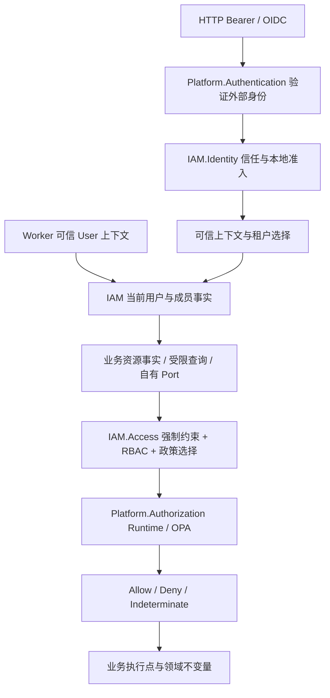

# IAM 与平台安全：当前实现

状态：Plan 05 仓库实现，2026-09-12。生产发布、真实 IdP 联调和目标数据审计待执行。[English](iam-platform-security.en.md) · [阶段证据](evidence/plan05/README.md) · [实施计划](plans/05-iam-platform-security-refactor.md)。

## 职责与依赖

Auth 已更名为一个 IAM 模块，保留 Domain、Application、Infrastructure、Presentation、Composition、Contracts 六个项目，内部划分四个子域，没有引入独立微服务或跨库 IAM 事务。

| Owner | 当前职责 |
| --- | --- |
| IAM.Identity | 注册/登录编排、可信 IdP、issuer/subject 绑定、本地准入、SSO provisioning |
| IAM.Users | 本地用户资料与启停；PrimaryTenantId 是偏好，不能替代成员资格 |
| IAM.Access | 角色、权限、授予、政策管理、选择及 RBAC/ABAC 组合 |
| IAM.Tenancy | 租户/部门、现有 UserTenants 成员关系及一致性 |
| Platform.Authentication | Contracts、Runtime、Cognito/Auth0 Adapter、Composition；执行 token 验证、OIDC/PKCE、凭证及账户技术操作 |
| Platform.Authorization | Contracts、Runtime、OPA Adapter、Composition；参数/条件处理、技术求值、结果归一化 |
| 业务模块 | 各自的资源事实、受限查询、执行点和领域状态转换 |

Application 使用自己的 Port，Infrastructure Adapter 消费外部 Contracts。IAM Composition 统一装配平台认证和授权，API/Worker 共用实现。平台 Runtime 不读 IAM/业务数据库，不定义平台角色特权。BuildingBlocks.Security 仅保留有真实消费者的 ICurrentUser、IPermissionChecker、ForbiddenException。

图为运行流程；项目依赖以 [当前 LayerGuard 图](evidence/plan05/current-dependency-graph.json) 为准。列表入口获准后仍须应用资源模块的租户过滤，不能据此返回全部记录。

## 身份、授权与失效

Token 验证 issuer、audience、算法、签名与有效期。OIDC 使用请求绑定的一次性 state、nonce、PKCE；UserInfo subject 必须匹配。IAM 检查当前启用的可信 IdP 和 active 本地用户，不因 email 相同合并不同 issuer/subject。外部 roles、tenant、permission claims 不能直接成为本地授权事实。

生产 IExecutionIdentityFacts 唯一绑定 VerifiedIdentityFacts。每次授权入口刷新 IAM 当前用户、成员与授予；HTTP 与可信 User 类型 Worker 使用相同事实。停用账号/租户、退出成员或撤销角色在下一次授权检查生效，即使旧 token/context 仍存在；不保证即时中断已经执行中的操作。匿名 HTTP 不回退 Worker 身份，错误 actor/type/source/provenance、tenant 或缺上下文被拒绝。

租户授权要求认证、本地 active 用户、有效成员、执行租户与资源租户一致，再组合 RBAC 与适用 ABAC。政策语义 v2 要求必要条件同时满足，明确 self-read 仍接受适用 ABAC。GlobalRole 使用独立平台作用域：PlatformAdmin 对已知操作有显式授权，其他角色使用具名范围及所有适用角色政策的交集。GlobalRole 不自动产生租户成员。跨租户 inventory 保留原 Platform.GlobalRole:manage 门槛，目前由平台作用域 PlatformAdmin 获得。

代码强制约束、明确缺省策略、租户自定义与平台角色政策分开管理。NotConfigured、Disabled、Invalid、Unavailable 不混用；禁用记录、无效条件、缺参数、数据库错误、OPA 不可用都不自动降级放行。禁用 OPA 或旧 FailClosed=false 配置也不允许访问。租户不能覆盖强制约束；未知属性、操作和超限输入失败关闭。政策版本取自当前内容和 scope，没有跨请求政策/决定缓存，不依赖失效广播。

认证 Contracts 中 token/credential 为受限瞬态字段，不进入事件、持久任务或日志。授权 Contracts 仅包含限定事实和条件，不暴露 EF entity、IQueryable、HttpContext 或 SDK/OPA 类型。OPA 日志记录决定标识、版本、结果和 reason，不记录事实和参数。

## 数据与兼容

| 对象 | 存储与约束 |
| --- | --- |
| IAM / IfxDbContext | auth schema、AuthDatabase 连接键、auth.__EFMigrationsHistory 不变 |
| UserTenants | 唯一成员事实，原复合主键保留，不新建重复 Membership 表 |
| UserRoles / UserRoleGroups / UserDepartments | 授予必须属于成员所在租户；组内角色也必须同租户 |
| UserGlobalRoles | 独立平台授予，退出普通租户不删除 |
| Users.PrimaryTenantId | 可空且必须指向有效成员；退出对应租户时清空 |
| Tenants.IsActive | 新增非空 bool，旧行默认 true；有效成员还要求 User.IsActive |

IAM 成员/授予写入使用同一 Serializable 事务，持久化层提交前检查实际关系。退出原子清理该租户角色、组、部门和主租户偏好，保留其他租户关系。并发竞争可能使一个事务失败，此时重试整个用例。

新增迁移仅为 20260912101127_EnforceActiveTenantMembership 的 additive 列。没有从孤立角色推断成员，没有自动改写旧政策。目标库须先运行 scripts/sql/plan05-membership-audit.sql 与 plan05-policy-classification-audit.sql，处理歧义并保存对账。

/api/v1/auth、原配置键、逻辑 module ID Auth 与 schema 保持稳定。唯一已知持久旧 Auth cleanup 类型有精确 alias，并测试恢复后的方法执行；未知旧类型失败。详见 [兼容清单](evidence/plan05/compatibility-identifiers.json)，仍需盘点目标队列、重试和未来定时任务。

## 发布与回退

1. 目标审计：保存备份、行数、关系、政策与旧任务清单；解决歧义，不自动补权限。完成真实 IdP 与协议准入验收。
2. 发布准备：生成 Release SQL/manifest，核对哈希、风险策略及五个 EF snapshot。旧 manifest 默认拒绝未知 migration，不能假定旧消费者直接兼容。
3. 顺序：受控 Migrator apply/validate → 兼容 Worker 消费者 → API/readiness → 恢复流量。需要旧消费者并行时，先交付已验证 schema、任务与授权行为的兼容版本；单独扩 migration allowlist 不足以证明行为安全。
4. 结构回退：旧二进制同时需要 schema、Contracts 和任务兼容。仓库验证了 planner 与 alias，没有启动目标环境旧二进制。
5. 数据回退：仅在隔离库、没有新状态时演练 Down/reapply 和成员行保留。生产不自动 Down；租户已停用后删除 IsActive 会丢失拒绝状态，应保留 schema 并修复前进，或另行评审恢复方案。
6. 行为回退：不能恢复旧 claims 授权、全局角色绕过或 OPA 失败放行。结构兼容不代表语义安全，需保留拒绝状态。

隔离 SQL 覆盖旧库升级、重复迁移、readiness 矩阵、无新状态的 Down/reapply 和新拒绝状态保留。既有受控 Migrator matrix 覆盖五 owner、权限和故障恢复。API/Worker Composition 与旧任务调用有自动化验证；真实滚动发布、恢复时间、目标性能与生产验收仍待执行。

## 限制与后续

OIDC 事务当前存于进程内，多实例故障切换前需要粘性会话或共享存储。Auth0 password-login 保留既有未实现路径，真实 Cognito/Auth0 联调未执行。Bearer 准入当前传递已验证 issuer/subject，没有承诺完整 MFA 事实传播。两个新增授权协议仍为 G03 Proposed；门禁通过不等于具名批准。IAM0.4 数据审计、目标任务盘点、DB 权限/RLS、容量/SLO 和正式发布回退签署均待执行。

[Platform 讨论](platform-capabilities-and-tenant-connections.zh-CN.md)单独保留。通用连接中心、租户自带 provider credential、独立 Tenancy/AccessControl 及租户自带 OPA 均未在本计划实现。
