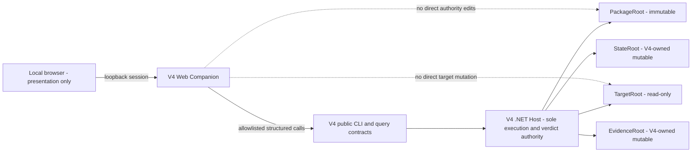
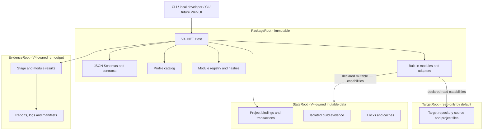
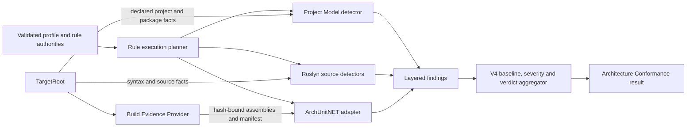
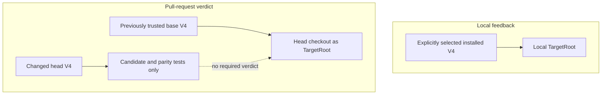
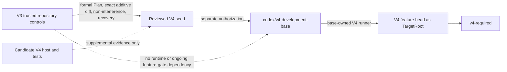

# V4 runtime architecture

Status: V4 v1 published; V4-P9 Lightweight Web UI implemented and gate-audited; remote activation not authorized

Decision authority: `00-architecture-decision-set.md`

This document is the maintained architecture view for V4 v1. It shows ownership and data flow; it
does not grant authority to create the development branch, runtime, workflow or remote configuration.

## Lightweight Web UI topology



The companion is a separately packaged local integration, not another guard engine. It serves immutable
assets on loopback, accepts only schema-bound operations and renders host-produced results. It cannot
define commands, execute arbitrary programs, interpret a verdict independently or infer a target from
the package or process working directory. V4-P9 first release supports one active Target context and
does not create a multi-project or remote control plane.

### P9.1 implemented spike boundary

The P9.1 Companion is a separate .NET process under `integrations/web`. Its trusted launcher fixes the
Host DLL and all four roots before Kestrel binds to IPv4 loopback. The browser receives an HTTP-only,
same-site session and may submit only a strict `stage`, fixed installed `synthetic_profile` and a
boolean dependency choice. Unknown or duplicate fields, another Profile, missing/wrong origin and a
non-loopback Host header fail before process invocation.

The Companion starts the existing `v4-guards.dll` with shell execution disabled and a constructed
`ArgumentList` for the stable `stage run` command. It returns the Host JSON and exit code unchanged;
the presentation labels that value as the Host result. Windows-native and pinned Linux tests prove one
synthetic Target-to-result flow, PackageRoot/TargetRoot immutability, mutable-root separation and input
injection refusal. These spike endpoints remain separate from the durable read/query contracts added
in P9.2.

### P9.2 implemented read/query boundary

The Host now exposes six experimental, schema-versioned, read-only projections: project binding,
installed Profiles, prerequisites, runs, evidence and Plans. The separate `query-contract.json`
registers exact syntax, roots and result schemas without changing the V4 1.0.0 stable CLI contract.
Every query first validates PackageRoot and its registered query contract. State and Stage results are
validated against their registered authority schemas before projection, and the generated response is
validated before it is emitted.

Queries use deterministic IDs, SHA-256 hashes, counts and relative paths rather than file timestamps.
They write no data beneath the four V4 roots. The prerequisite projection preserves a validated report
without treating it as a Stage verdict. Plan discovery delegates V4-native validation to the Plan
runtime; structurally valid V3-formal pairs remain explicitly labelled historical read-only
compatibility views. Windows and pinned, network-disabled Linux tests prove root byte invariance and
fail-closed overlap, traversal and evidence-tamper behavior.

### P9.3 implemented workspace and Stage Runner boundary

The Companion accepts one or more trusted `TargetRoot` startup arguments and asks the Host for each
project identity. The browser never submits a path: it switches the single in-memory active Target by
an exact Host-derived project ID. Registered Targets must be unique and non-overlapping. StateRoot and
EvidenceRoot remain explicit shared mutable roots, while PackageRoot and every TargetRoot remain
read-only.

The workspace obtains installed Profile, module and per-Stage configuration from `query profiles` and
runtime status from `query doctor`. Disabled Stages and uninstalled Profiles fail before execution.
The selected Stage and optional ordered dependency chain are visible in the UI; execution still uses
only the Host `stage run` contract and returns its JSON and exit code without reinterpretation.

Target switching and UI-originated runs share one non-blocking run gate. A switch or second run while
execution is active receives `409 run-active`, so the Companion cannot create parallel project
contexts or Stage processes. Host-derived Profile and registered-Target projections are cached only for
the Companion process lifetime to make Target selection immediate; a completed Stage causes the affected
Target projection to be refreshed from the Host. The cache is presentation state, never execution
authority. The workspace selection itself is process-local and writes no new state. Windows and pinned,
network-disabled Linux suites prove two-Target selection, active-Target execution, dependency visibility,
concurrency refusal, injection refusal and root confinement.

### P9.4 implemented evidence and Plan presentation boundary

The evidence desk accepts no evidence paths. It asks the Host for the active project's run catalog,
then selects evidence by a validated Host run ID. The complete `query evidence` projection is returned
unchanged and rendered as Host status, findings, coverage, module results, evidence-file metadata,
authority hashes and raw JSON. Presentation comparisons such as matched versus minimum do not create a
second aggregate status or override the Host verdict.

The trusted launcher fixes one relative Plan root for all registered Targets before listening; the
browser selects only a validated Plan ID. The Companion first obtains the active Target's Host Plan
catalog, resolves only the selected Host-projected pair, repeats containment/link checks, caps each file
at 1 MiB, decodes strict UTF-8 and requires byte hashes to match the Host projection. Markdown is built
with text-only DOM nodes, so source HTML, links, images, scripts and event attributes remain inert.

Plan presentation has two explicit modes. V4-native Plans use `native-contract` and `v4-plan-valid`.
Current V3-formal historical Markdown/JSON pairs use `historical-read-only` and
`v3-compatibility-view`; presentation does not convert them into V4-native authorities. The viewer
writes no state and provides no edit, Target mutation, reset, Git or remote path.

### P9.5 implemented offline distribution boundary

The three reviewed UI source files are embedded directly into the deterministic Companion assembly.
The loopback server maps only `/`, `/index.html`, `/app.js` and `/styles.css` to those fixed resources;
the runtime output has no loose `wwwroot` that a hostile parent or working directory can replace.

The versioned V4 distribution now has three hash-bound payloads: immutable PackageRoot, the Host and
the Web Companion. `distribution-manifest.json` records the Companion entry-assembly hash and exact
`companion/*` files; the external install receipt binds those bytes through install, drift-refusing
uninstall and identical reinstall. The installed launcher fixes the shipped PackageRoot and Host path,
allows only Companion root/Plan/port options as an argument array, checks the declared .NET prerequisite
and uses no command shell.

Every P9 test is included in the exact CI test inventory for Linux complete and Windows full. The P9.5
lifecycle additionally covers two independent deterministic builds/archives, installed embedded-asset
bytes, hostile parent configuration, authority override, path escape, Markdown execution sinks and
Companion assembly drift.

### P9.GATE audited boundary

The final gate binds native Windows-full and pinned network-disabled Linux-complete reports to the same
clean commit, package hash and exact CI-selected test inventories. A separate source audit confirms one
shell-free Host process gateway, two schema-bound mutation routes, loopback/origin enforcement, no
Companion filesystem write primitive and text-only rendering of untrusted Host and Plan content.

`05-p9-gate-audit.md` accounts for every first-release exclusion in V4-TODO-005. No authority/Plan
editing, Target mutation, Reset Apply, Git/GitHub operation, terminal/raw arguments, remote access,
extension installation, multi-project parallelism or IFX-specific behavior is present. P9.GATE closes
the planned local UI release only; it does not authorize remote use, workflow/ruleset activation,
release/tag publication, IFX adoption or cutover.

## System and root boundaries



`PackageRoot`, `TargetRoot`, `StateRoot` and `EvidenceRoot` are explicit inputs. The process working
directory and package location never select the target. Local ignored data may use `V4/.work`; CI
places mutable roots under an isolated runner-temporary V4 namespace.

## Architecture Conformance composition



The stable module is `architecture-conformance`; detector brands are internal implementation choices.
The module does not run the LayerGuard-derived engine in production. During development only, a frozen
V3 reference may run beside V4 to compare architecture claims and coverage.

## Evidence and Stage allocation

| Evidence kind | Owner | Earliest Stage | Target execution | Examples |
| --- | --- | --- | --- | --- |
| Raw declared project model | Project Model detector | Pre | none | project/package references, names, ownership |
| Source syntax | Roslyn syntax detector | Pre | none | imports, disabled branches, declaration text |
| Evaluated/semantic source | Roslyn semantic detector | Post | isolated build context | bound symbols, member and payload types |
| Compiled assembly semantics | ArchUnitNET adapter | Post | isolated Build Evidence Provider | type dependency, implementation and namespace placement |
| Policy, baseline and verdict | V4 Host | Pre/Post | none | rule plan, severity, non-vacuity and aggregate status |

Pre never invokes target-owned MSBuild targets, analyzers, generators or executables. Post may use a
declared process capability to build an isolated target copy or output tree under `StateRoot`. A report
must distinguish raw declarations, evaluated state and compiled semantics.

## Local and pull-request trust topology



Local and CI use the same CLI and result schemas. CI additionally pins the trusted base revision,
target revision, mutable roots and evidence bindings. A candidate host or detector never judges its
own change.

## Genesis bootstrap and autonomy transition



The V3 bootstrap is a finite genesis ceremony, not a V4 execution layer. It ends when the accepted,
hash-bound seed becomes the immutable V4 development base and that base can evaluate candidate heads.
Subsequent V4-only changes use V4 Plans or plan-sets and V4 checks; V3/V3_ifx continues separately as
the active IFX guard until the deferred production cutover.

## Architecture Conformance migration boundary

```text
V4 v1
  capability matrix
      -> Project Model + Roslyn + ArchUnitNET detectors
      -> synthetic claim parity
      -> no V3/LayerGuard runtime dependency

Post-v1 IFX practice
  ifx_profile
      -> V3/V3_ifx and V4 parallel evidence
      -> real IFX negative controls
      -> trusted-base cutover and rollback
      -> final LayerGuard freeze or authorized retirement
```

Plan 06 section 20 closes only after the post-v1 IFX cutover and retirement boundary completes.
