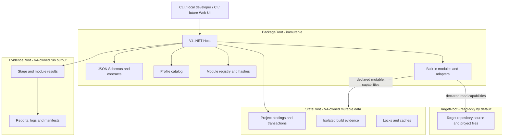
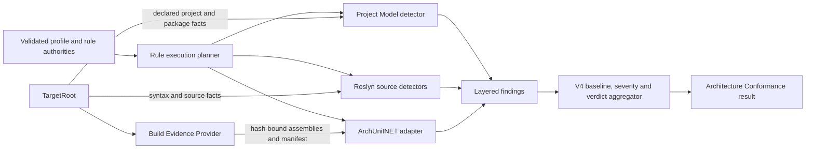
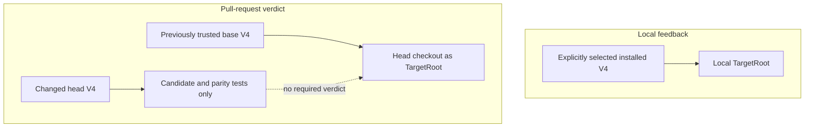
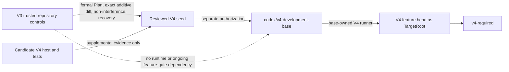

# V4 runtime architecture

Status: accepted planning view; implementation not authorized

Decision authority: `00-architecture-decision-set.md`

This document is the maintained architecture view for V4 v1. It shows ownership and data flow; it
does not grant authority to create the development branch, runtime, workflow or remote configuration.

## System and root boundaries



`PackageRoot`, `TargetRoot`, `StateRoot` and `EvidenceRoot` are explicit inputs. The process working
directory and package location never select the target. Local ignored data may use `V4/.work`; CI
places mutable roots under an isolated runner-temporary V4 namespace.

## Architecture Conformance composition



The stable module is `architecture-conformance`; detector brands are internal implementation choices.
The module does not run the LayerGuard-derived engine in production. During development only, a frozen
V3 reference may run beside V4 to compare architecture claims and coverage.

## Evidence and Stage allocation

| Evidence kind | Owner | Earliest Stage | Target execution | Examples |
| --- | --- | --- | --- | --- |
| Raw declared project model | Project Model detector | Pre | none | project/package references, names, ownership |
| Source syntax | Roslyn syntax detector | Pre | none | imports, disabled branches, declaration text |
| Evaluated/semantic source | Roslyn semantic detector | Post | isolated build context | bound symbols, member and payload types |
| Compiled assembly semantics | ArchUnitNET adapter | Post | isolated Build Evidence Provider | type dependency, implementation and namespace placement |
| Policy, baseline and verdict | V4 Host | Pre/Post | none | rule plan, severity, non-vacuity and aggregate status |

Pre never invokes target-owned MSBuild targets, analyzers, generators or executables. Post may use a
declared process capability to build an isolated target copy or output tree under `StateRoot`. A report
must distinguish raw declarations, evaluated state and compiled semantics.

## Local and pull-request trust topology



Local and CI use the same CLI and result schemas. CI additionally pins the trusted base revision,
target revision, mutable roots and evidence bindings. A candidate host or detector never judges its
own change.

## Genesis bootstrap and autonomy transition



The V3 bootstrap is a finite genesis ceremony, not a V4 execution layer. It ends when the accepted,
hash-bound seed becomes the immutable V4 development base and that base can evaluate candidate heads.
Subsequent V4-only changes use V4 Plans or plan-sets and V4 checks; V3/V3_ifx continues separately as
the active IFX guard until the deferred production cutover.

## Architecture Conformance migration boundary

```text
V4 v1
  capability matrix
      -> Project Model + Roslyn + ArchUnitNET detectors
      -> synthetic claim parity
      -> no V3/LayerGuard runtime dependency

Post-v1 IFX practice
  ifx_profile
      -> V3/V3_ifx and V4 parallel evidence
      -> real IFX negative controls
      -> trusted-base cutover and rollback
      -> final LayerGuard freeze or authorized retirement
```

Plan 06 section 20 closes only after the post-v1 IFX cutover and retirement boundary completes.
